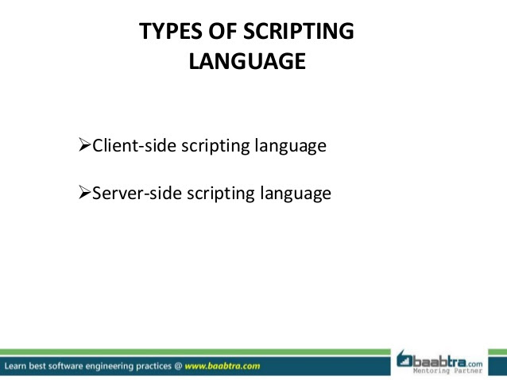
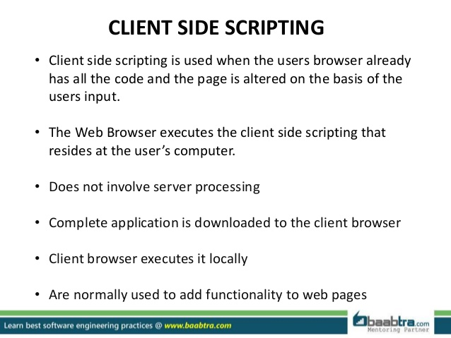
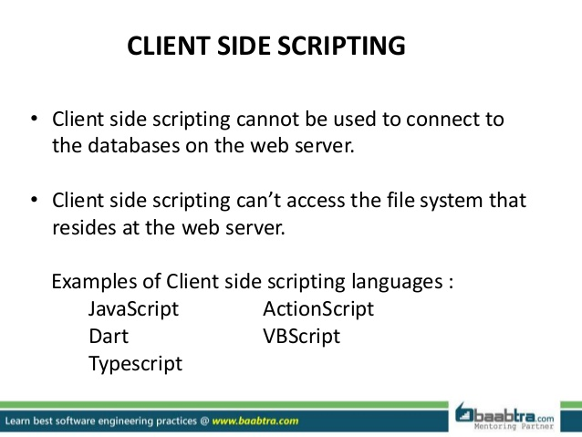
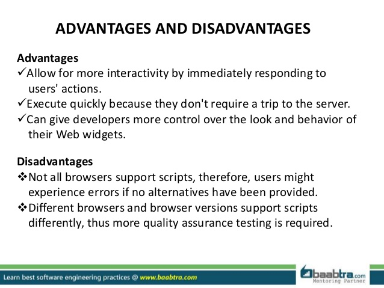
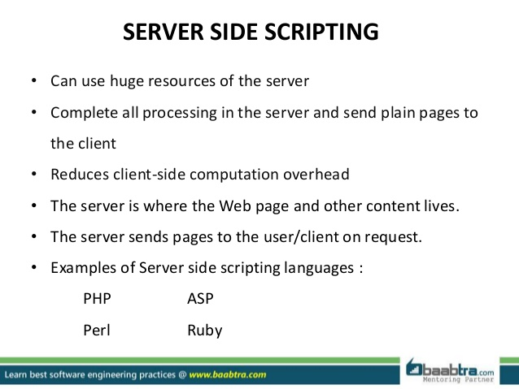
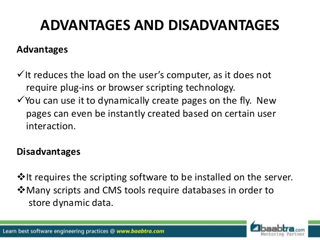
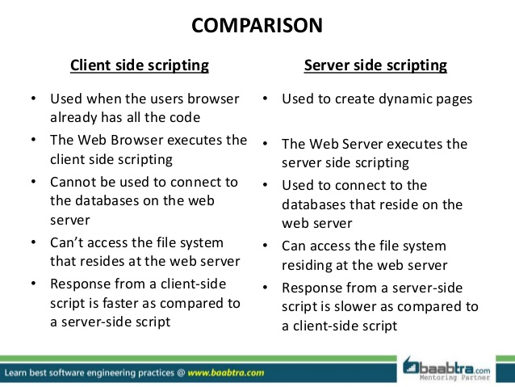

# Architecting

## 1- Separation of concerns:
#### What kind of tasks are normally handled in the back end, and which are more usually handled in the front end? Why?

## First : What is meant by front end and back end ?

#### Front-end development and back-end development work in tandem to create a website or application for users. In simple terms, front-end development is what is used to create the visual display that the end user of a website experiences. Back-end development is what makes the presentation of front-end development possible. When a user attempts to access an application via the front-end interface, the relevant information is verified via the back-end database, and the proper information is then presented to the user via the back-end Web server.

# - Front-end
### The front end typically includes the HTML, CSS and JavaScript that creates pages, menus, buttons and everything else that forms the basis of what the user sees in his or her Web browser. So someone working as a front-end developer would be familiar with code that focuses on display, and may also have Web design skills with tools like Photoshop.

# - Back-end
### The back end generally includes a Web server that hosts an application (built with code like Node.js, PHP, Python,  Ruby on Rails, C/C#/C++ , .NET, or Java), which communicates with a database (using something like MySQL or Microsoft Access) to serve up the information that the front-end presents. Back-end developers have expertise in building applications that can efficiently locate and deliver data.

## Why we want to separate between front and back end ?
#### As an example of how front-end and back-end systems work together, consider a website that has different content that is accessible to users with different permissions. When a user visits the website and attempts to access a certain page, he or she will be asked to log in; that login information will be authenticated via a database lookup, and then the back-end application communicates with the front end (sometimes via an intermediary program) to display the proper page to the user.

## -2 What are the adv and dis of running code on the client, rather than the server (and vice versa)?

## Technologies used in backend

Firstly we should know that the programming language used in the backend part of a particular software or web-application determines the OS that should be installed on the server machine. For example, choosing ASP.NET will make Windows Server mandatory, although there are alternatives like Mono that would let us work with Linux, but it’s not as complete as Windows libraries. Any other language will let us work with Linux or Windows, although Linux is preferred because of its good packaging system. 

## Languages and frameworks

### PHP

PHP is maybe the most popular language for web development. It’s pre-installed in almost all hosting services. It has a syntax very similar to C and Java, so coming from these languages is a plus in familiarity (it’s my case).

It started as a procedural language, making a transition to object orientation in version 4, and finally being a true object oriented language in version 5. Version 7 bring more features to the language, and makes great improvements to speed and memory consumption.

### Python

Python is a language that uses a simpler syntax than PHP. It’s designed to have a very readable code, and for that reason is very recommended to learn programming.

### Ruby

Ruby is designed to be a fun language. As the slogan says: a programmer’s best friend. It has a focus on simplicity and productivity with an elegant syntax.

In Ruby everything is an object, and that’s interesting because it encourages to the programmer to think this way when developing.

## What Node is
1. Node is a server which can execute JavaScript. Sort of a server side browser.
2. Node is a open source, cross platform to make real time network applications.
3. It provides you asynchronous, event driven I/O APIs.
4. It runs single threaded event based loop, so all executions become non-blocking.

## What node is NOT
1. Node is not a framework, it’s a server.
2. Node wrappers over JavaScript V8 Runtime, are not made in JavaScript, but made in C.
3. It’s not multi-threaded. It runs in a single thread with callback concept.
4. It’s not for JavaScript beginners as it’s very low level.

|   pros     |      cons      |
|  :---:     |     :---:      |
| 1. Asynchronous event driven IO helps concurrent request handling. |  1. Node.js doesn’t provide scalability. One CPU is not going to be enough; the platform provides no ability to scale out to take advantage of the multiple cores commonly present in today’s server-class hardware. |
| 2. Uses JavaScript, which is easy to learn. | 2. Every time using a callback end up with tons of nested callbacks.  |
| 3. npm, the Node packaged modules has already become huge, and still growing. | 3. Without diving in depth of JavaScript if someone starts Node, he may face conceptual problem.|

## Why to use Node.js?
- Non-blocking code
- Fast processing
- Easy to learn
- Popularity and community

### References
- https://www.slideshare.net/BaabtraMentoringPartner/client-server-side-scripting           (2)
- https://tutorialzine.com/2015/12/the-languages-and-frameworks-you-should-learn-in-2016    (3)
- http://voidcanvas.com/describing-node-js/                                                 (3)
